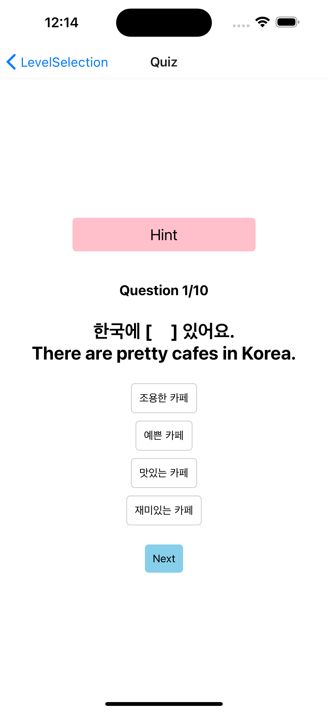
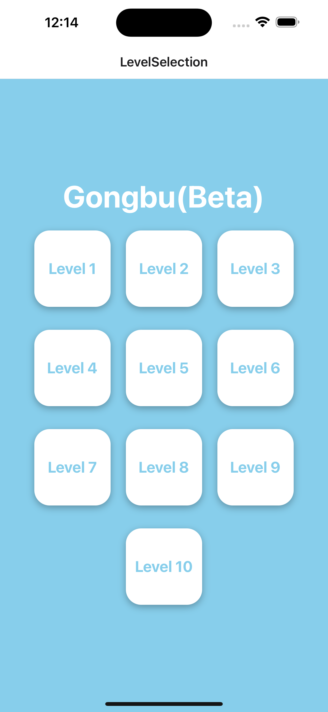

# Gongbu
Gongbu is a Korean learning quiz app designed to help you improve your Korean language skills while having fun. Whether you're a beginner or an intermediate learner, Gongbu offers a range of levels and questions to challenge your Korean language proficiency.

## Screenshots

  

    
  

  

    
  

## Table of Contents
* Features
* Prerequisites
* Usage

## Features
Gongbu offers the following features:

Quiz Mode: Test your knowledge by answering multiple-choice questions related to the Korean language.

Score Tracking: Keep track of your score as you progress through the quiz.

Randomized Questions: Questions are randomly selected from a database to ensure variety and challenge.

Results Page: View your score and see correct and incorrect answers at the end of the quiz.

## Prerequisites
Before you can run Gongbu, ensure you have the following prerequisites installed:

Node.js (v14 or higher)
React Native (v0.64 or higher)
Firebase (for the backend)

Or, you can check it out on Appstore soon.

## Usage
Launch the app and select your desired quiz level from the main screen.

Answer the questions by selecting one of the provided options.

Receive immediate feedback on your answers and track your score.

Progress through all the questions to complete the quiz.

View your final score and review correct and incorrect answers.
